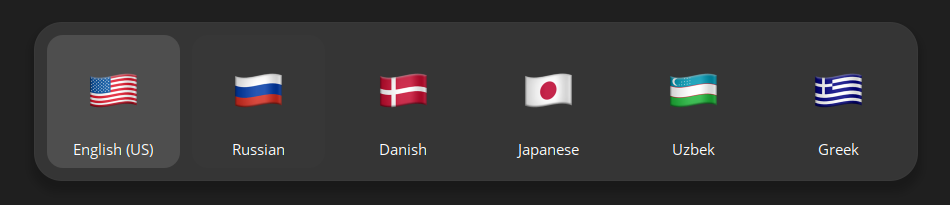
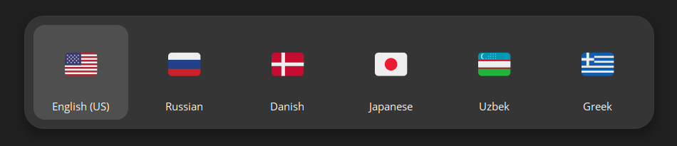

# Flags in evdev.xml

Enhances language labels in `evdev.xml` by replacing them with Emoji flags based on ISO 3166 codes.

## Installation
1. Clone this repository.
2. Run the script to generate `evdev.xml`: `python evdev-emoji.py`
3. Move the generated `evdev.xml` to the system directory `sudo mv evdev.xml /usr/share/X11/xkb/rules/evdev.xml`
   Note: A backup (`evdev.xml.bkp`) of the original file is created.
4. Restart GDM or reboot to apply changes.
5. Enjoy improved language labels with Emoji flags.

## Customize Emoji Set

Change the emoji set using different fonts.

### JoyPixels

#### ArchLinux
`paru -S ttf-joypixels`
#### Ubuntu
`sudo apt-get install fonts-joypixels`

---

### Apple Emoji

#### ArchLinux
`paru -S ttf-apple-emoji`
#### Ubuntu [Similar to Apple Emoji]
`sudo apt-get install fonts-noto-color-emoji`

---

### Twemoji

#### ArchLinux
`paru -S ttf-twemoji-color`
#### Ubuntu
`sudo apt-get install fonts-twemoji`