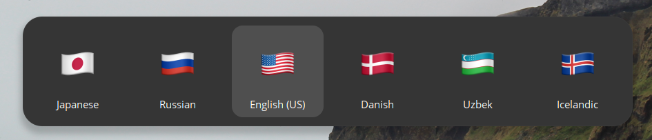

# Flags in evdev.xml

Enhances language labels in `evdev.xml` by replacing them with Emoji flags based on ISO 3166 codes.

## Installation

1. Clone this repository.
2. Run the script to generate `evdev.xml`: `python evdev-emoji.py`
3. Move the generated `evdev.xml` to the system directory `sudo mv evdev.xml /usr/share/X11/xkb/rules/evdev.xml`
   Note: A backup (`evdev.xml.bkp`) of the original file is created.
4. Restart GDM or reboot to apply changes.
5. Enjoy improved language labels with Emoji flags.

## Customize Emoji Set

Change the emoji set using different fonts.

### Arch Linux

1. `pacman -S ttf-joypixels`      - Install JoyPixels
2. `paru -S ttf-twemoji-color`    - Install Twemoji
3. `paru -S ttf-apple-emoji`      - Install Apple Emoji
4. `paru -S ttf-mutant-emoji`     - Install Mutant Emoji
5. `paru -S ttf-mizutama-emoji`   - Install Mizutama Emoji

### Ubuntu

1. `sudo apt-get install fonts-joypixels`         - Install JoyPixels
2. `sudo apt-get install fonts-twemoji`           - Install Twemoji
3. `sudo apt-get install fonts-noto-color-emoji`  - Install Noto Color Emoji (similar to Apple Emoji)
4. `sudo apt-get install fonts-mutant-emoji`      - Install Mutant Emoji
5. `sudo apt-get install fonts-mizutama-emoji`    - Install Mizutama Emoji